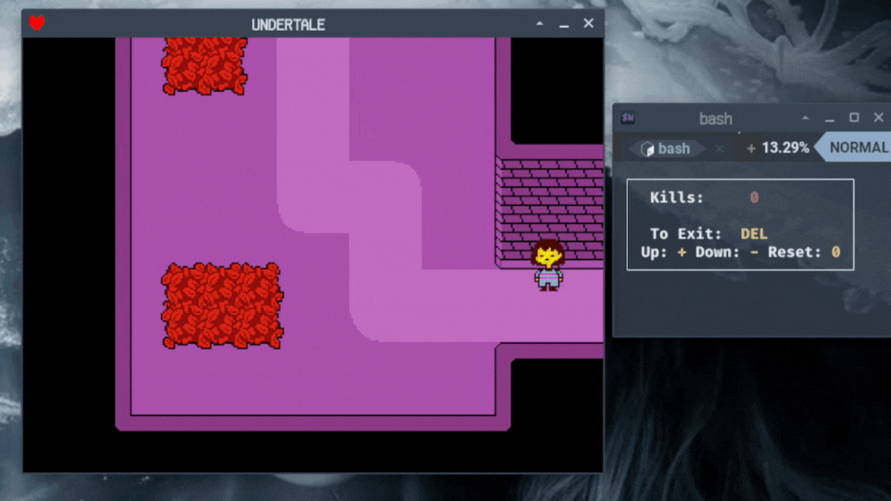

# Undertale_Genocide_Kill_Counter

Terminal counter for kills during Genocide route in Undertale

Pair it with [flitter](https://github.com/alexozer/flitter) or [obs-livesplit-one](https://github.com/LiveSplit/obs-livesplit-one) and [input overlay](https://github.com/univrsal/input-overlay) to have full layout

## Usage

| Key                | Function  |
| ------------------ | --------- |
| `+`,   `a`         | Add 1     |
| `-`,   `s`         | Subtract 1|
| `0`,   `r`         | Reset     |
| `del`, `q`         | Exit      |

*Script works without focus on terminal, this means you can exit it if typing in e.g browser*

> [!NOTE]
>
> If your inputs  don't get registred use `xinput list` to find your keyboard input and change value of `DEVICE_ID` to the given number.
>
> If box isn't displayed, press any button to make it appear.
>
> This script changes `xset r rate` for time of usage.
